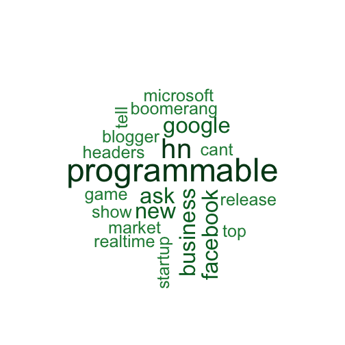

## Motivation, Approach and User Interface

* A word cloud visualization of a given Twitter user's tweets. 
* Useful for getting a simple idea about the user's areas of interest and preferences.
* Some customization allowed for the Shiny App user to explore. 
* Use the `twitteR` package to get tweets corresponding to a user's timeline. 
* Use the `tm` package to clean up the obtained tweets and extract complete words. 
* Use the `wordcloud` package to plot the corresponding wordcloud thus obtained.
* User Interface consists of the following parameters: 
    - `Twitter UserName` 
    - `Number of Previous Tweets?`
    - `Include Re-tweets?`
    - `Include Replies?`
    - `Color Palette`

---

## An Example using R Code

We create a tweet wordcloud from `hackernews` twitter timeline as follows. 


```r
library(twitteR)
library(tm)
library(wordcloud)
library(RColorBrewer)
load("twitter_tokens")
setup_twitter_oauth(consumer_key, consumer_secret, access_token, access_secret)

user_name <- "hackernews"
number_of_tweets <- 100
exclude_replies <- FALSE
include_retweets <- FALSE
tweets_list <- userTimeline(user_name, n = number_of_tweets, includeRts = include_retweets, 
                            excludeReplies = exclude_replies)
tweets_df <- twListToDF(tweets_list)
# build a corpus, and specify the source to be character vectors 
tweets_Corpus <- Corpus(VectorSource(tweets_df$text))
```


---


```r
# plot word cloud
wordcloud(words = names(word.freq), freq = word.freq, min.freq = 3,
          random.order = F, colors = pal, scale=c(4,.2))
```

 

---

## Project Code

* The complete source code `ui.R` and `server.R` files for the Shiny App are available at https://github.com/veeresht/ShinyAppCode

